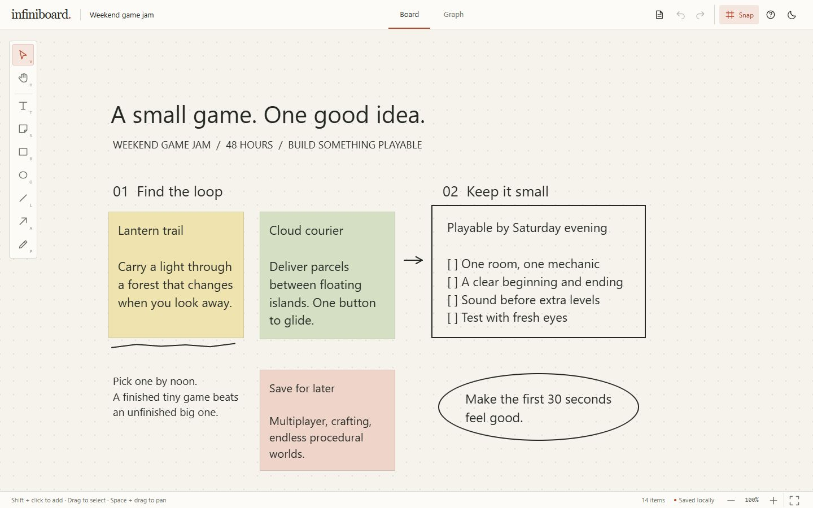
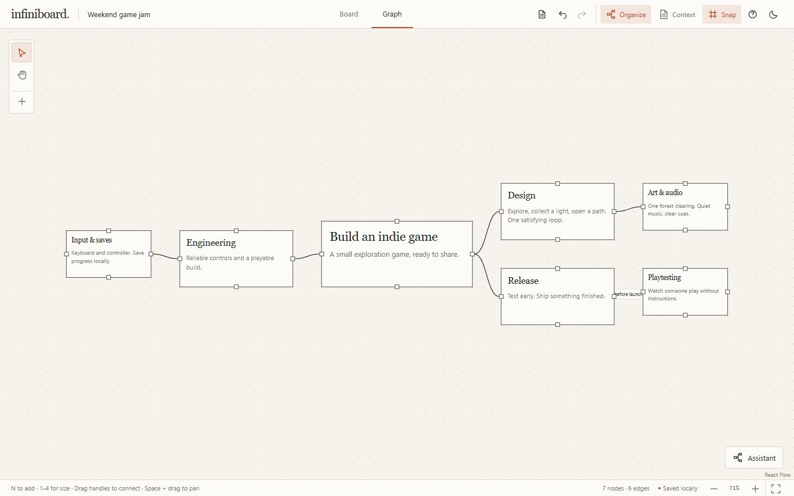
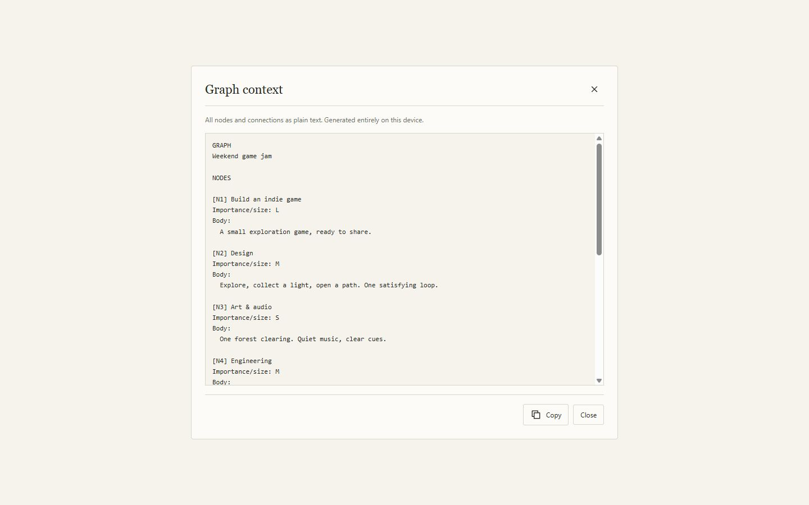

<p align="center">
  
</p>

<p align="center">An infinite whiteboard and mind map for thinking things through.</p>
<p align="center">
  
  
  
  <a href="LICENSE"></a>
</p>
<p align="center"><a href="#board">Board</a> · <a href="#graph">Graph</a> · <a href="#local-first-by-design">Privacy</a> · <a href="#getting-started">Getting started</a></p>

## What is Infiniboard?

One local project, two independent canvases. Use **Board** to sketch, collect notes and explore ideas freely. Use **Graph** to give those ideas structure: topics, details and relationships, with size expressing importance.

There are no accounts, collaborators or project servers. Both views autosave in your browser. JSON files let you back up or move your project; an optional Graph assistant can turn pasted notes into a branching map using **your own OpenAI key**. Paper and charcoal themes share quiet chrome, crisp borders and a restrained accent.

## Board



An infinite canvas for text, sticky notes, rectangles, ellipses, lines, arrows and freehand pen. Select one or many items, move or resize them, duplicate, delete and undo. Text and stickies grow vertically as you type; their user-controlled width determines wrapping.

Pan and zoom without moving the content. An optional 24-unit dot grid adds snapping. Each tab retains its own viewport, selection and undo history.

## Graph



Double-click the canvas to add a node; double-click a node to edit its title and optional body. Drag between square handles to connect ideas, label the relationship, or drag a selected edge endpoint to reconnect it. Multi-select, box-select, duplicate and undo work here too.

**Importance is size.** S / M / L / XL presets step up typography as well as dimensions. Resize cards freely. AI-generated cards initially fit their content; later manual dimensions remain authoritative. Very long text scrolls inside the card.

Arrange nodes by hand for as long as you like. **Organize** explicitly lays out the existing graph using its actual card sizes, then fits it into view. It runs locally, changes no text or connections, and is one undo step. Small trees use a two-sided arrangement; larger trees radiate through compact hierarchical sectors. Cross-links and disconnected groups are retained.

**Context** turns every node and directed connection into copyable plain text, including bodies, labels and importance. Short references distinguish identical titles, and cycles and disconnected groups remain represented. Generating and copying Context happens entirely on your device.

<details>
<summary>See Graph Context</summary>



</details>

## Graph AI

The assistant is optional. Paste notes to **build a new map**, or select a node and **expand** it. The prompt favors semantic hierarchy over source headings or visual balance. Spelling cleanup and repeated/off-topic filtering are optional; omitted passages remain available to restore. Review the outline before **Apply**, which groups the change into one undo operation, or **Discard** it.

**The OpenAI API key is provided by the user.** Infiniboard supplies no key, free AI usage or shared proxy. In Graph, open **Assistant → Settings** to enter your key and choose model/effort preferences. No key is needed for Board, ordinary Graph editing, Organize or Context.

Keys default to tab memory and disappear on reload/close. **Remember on this device** is an explicit choice that saves the key in separate IndexedDB storage for that browser profile and origin. **Clear key** removes both the stored and current-tab copies. Credentials saved by older versions without consent are cleared on upgrade.

Only **Generate** sends notes, instructions and options directly to the OpenAI Responses API. Expansion also sends the selected node's title/body; the rest of the graph and Board are excluded. Requests use an Authorization header, omit cookies/referrers, reject redirects and set `store: false`. Cancellation may still incur usage; cost estimates are approximate and OpenAI billing/data policies apply. `store: false` does not promise zero provider retention.

## Local-first by design

**Local-first:** Infiniboard stores projects in your browser using IndexedDB. There are no Infiniboard accounts or shared project database. Your projects remain on your device unless you explicitly export them or submit content to an external AI service.

Editing, autosave, Organize and Context do not upload project contents. Browser profiles and origins have independent local stores; a fresh profile begins empty. The static host receives ordinary page and asset requests, but there is no project backend, cloud sync, analytics or content logger. Copying Context places text on your system clipboard; where you paste it is your choice.

Use JSON exports for portable backups. Clearing site data can erase your work, and session undo history is not saved. A project on localhost does not automatically appear on another browser or the deployed site.

The user's key goes directly to OpenAI when Generate is invoked, never to Infiniboard hosting. Keys are excluded from project files, Context, URLs, logs and application error messages. **Browser-side credentials are accessible to code executing in the page context.** Memory and IndexedDB are not perfectly secure: trust the code/origin you use, limit and monitor your key, and revoke it if compromised.

## Getting started

Use **Node 22.12+** and npm (Node 20.19+ is also supported).

```sh
git clone https://github.com/DefinitivedCode/infiniboard.git
cd infiniboard
npm ci
npm run dev
```

Open the URL Vite prints, normally `http://127.0.0.1:5173`. No backend, account, credential or environment variable is required. The repository must be accessible to your GitHub account while it remains private.

Never put a private API key into a `VITE_*` build variable: those values become public browser data. User keys belong in Assistant Settings only. [.env.example](.env.example) documents the intentionally empty setup.

### Development

| Command | Purpose |
| --- | --- |
| `npm run dev` | Local Vite development server |
| `npm run typecheck` | Strict TypeScript check |
| `npm run lint` | ESLint |
| `npm test` | All model/store/privacy tests using Node's built-in runner |
| `npm run build` | Typecheck and production build into `dist` |
| `npm run preview` | Preview the production build locally |

Tests mock AI requests and make no paid API calls. Development-only [browser fixtures](tests/browser/README.md) exercise 500 nodes / 700 edges, attachment geometry, assistant flows and real local persistence. They are excluded from the production build. Test output is ignored under `.verification/`.

Follow [DESIGN.md](DESIGN.md) for visual rules and [AGENTS.md](AGENTS.md) for implementation conventions. No component library or external font service is needed.

### Shortcuts

Press **?** for the current tab's keyboard reference. Canvas shortcuts pause in text fields, selects, composition and dialogs.

| Key / gesture | Action |
| --- | --- |
| V / H | Select / pan tool |
| Space + drag / middle drag | Temporary pan (Graph also supports right drag) |
| Wheel / pinch on Graph canvas | Zoom around pointer; no Ctrl/Cmd required |
| Wheel / Shift + wheel on Board | Pan / horizontal pan |
| Ctrl/Cmd + wheel on Board | Zoom around pointer |
| + / − / 0 / F | Zoom in / out / 100% / fit selection or canvas |
| G | Grid and snapping |
| T / S / R / O / L / A / P on Board | Text / sticky / rectangle / ellipse / line / arrow / pen |
| N / double-click empty Graph canvas | Add node |
| 1 / 2 / 3 / 4 on Graph | Size S / M / L / XL |
| Shift + click / drag | Add to selection / box-select |
| Ctrl/Cmd + A / D | Select all / duplicate |
| Arrows / Shift + arrows | Nudge 1 / 10 units (24 with snap) |
| Delete / Backspace | Delete selection |
| Ctrl/Cmd + Z | Undo |
| Ctrl/Cmd + Shift + Z / Ctrl/Cmd + Y | Redo |
| Double-click / Enter | Edit selected text, node or edge |
| Click away / Ctrl/Cmd + Enter | Commit text or node edit |
| Enter in edge label | Commit label |
| Escape | Cancel edit / clear selection / close dialog |

Scrollable node text keeps its own wheel scrolling. Shift constrains Board drawing and resizing. Drag between Graph handles to connect; select an edge and drag an endpoint to reconnect.

## Import & export

**Project files → Export JSON** downloads `infiniboard-YYYY-MM-DD.json`, containing both canvases, explicit dimensions, edge labels/handles, viewports, title/timestamps, theme and snap. The versioned envelope is:

```json
{ "format": "infiniboard", "version": 2, "project": { "...": "project data" } }
```

The abbreviated example shows the envelope only; see [project types](src/data/types.ts) for the actual structure. Tools, selections, session history and AI preferences/credentials are excluded. **Import JSON** validates the complete structure/version/references before confirmation. **Download backup and replace** saves the current project first, then replaces both canvases/settings. Invalid files never partially import. Existing IndexedDB v1 projects migrate independently of the JSON format.

JSON is the full portability/backup format. **Graph → Context → Copy** is a human/AI-readable graph representation, not an import format.

## Deployment

The deployment target is [infiniboard.masonmau.com](https://infiniboard.masonmau.com); this repository does not assume that a live deployment is available yet.

Use **Cloudflare Workers Builds / Static Assets**. Connect the private release repository in **Workers & Pages → Create → Import a repository** and use these build settings:

| Dashboard setting | Value |
| --- | --- |
| Project / Worker name | `infiniboard` |
| Git repository | `DefinitivedCode/infiniboard` |
| Production branch | `main` |
| Root directory | `/` (repository root; leave the default) |
| Build command | `npm run build` |
| Deploy command | `npx wrangler@4.148.0 deploy` |
| Build variable | `NODE_VERSION=22` |
| Optional preview command (non-production branches) | `npx wrangler@4.148.0 preview` |
| Runtime bindings / variables / secrets | None |

Workers Builds installs the npm dependencies before building. There is no Pages-style output-directory field to configure: [wrangler.toml](wrangler.toml) explicitly deploys **`./dist`**, the existing Vite output, and enables `single-page-application` fallback for navigation to unmatched paths. The Worker name must match `infiniboard`. Wrangler is pinned in the dashboard commands and fetched by npx; it is not an application dependency.

This is an **assets-only deployment**: no Worker entrypoint, application logic, backend, server persistence, asset binding or Cloudflare Vite plugin. Wrangler usage metrics and dependency instrumentation are explicitly disabled. Leave optional Web Analytics disabled and do not inject tracking scripts. Keep all runtime bindings/secrets empty; each user's OpenAI key still belongs only in Assistant Settings.

Vite copies [public/_headers](public/_headers) unchanged to `dist/_headers`. Workers Static Assets parses this file and applies its CSP, referrer, frame, content-type and permissions policies to asset responses, including the SPA fallback. `_headers` itself is not served as a public file. CSP API connections remain limited to OpenAI; inline styles support canvas positioning.

To validate locally without publishing anything, use Node 22 (Wrangler requires Node 22+):

```sh
npm ci
npm run build
npx wrangler@4.148.0 deploy --dry-run
npx wrangler@4.148.0 dev --local
```

The dry run validates configuration and prepares the asset manifest without uploading/deploying. The local Workers runtime lets you inspect actual response headers, fingerprinted JS/CSS, the favicon and refresh/navigation fallback. No Cloudflare account login or OpenAI key is required for these checks.

After the dashboard deploys, attach `infiniboard.masonmau.com` under **Worker → Settings → Domains & Routes → Add → Custom Domain**, then complete Cloudflare's DNS/HTTPS setup. This is a separate manual action. Import a JSON export to transfer localhost work to the deployed origin. See the official [Workers Builds settings](https://developers.cloudflare.com/workers/ci-cd/builds/configuration/), [static asset configuration](https://developers.cloudflare.com/workers/static-assets/), [asset headers](https://developers.cloudflare.com/workers/static-assets/headers/) and [Worker custom domains](https://developers.cloudflare.com/workers/configuration/routing/custom-domains/) documentation.

Before deploying publicly, repeat the [release privacy checklist](RELEASE-AUDIT.md) against the final HTTPS origin, including any scripts injected by the host. Repository publication and deployed-site verification are separate checkpoints.

## Tech stack

| Layer | Technology |
| --- | --- |
| UI | React 19, strict TypeScript, plain CSS variables/modules |
| Build | Vite |
| Board | Custom CSS-transformed world with granular subscriptions |
| Graph | @xyflow/react with memoized custom nodes/edges |
| State | Zustand |
| Persistence | Dexie / IndexedDB, debounced autosave |
| Optional AI | OpenAI Responses API (BYOK); Zod output validation |

Pan/zoom avoids unrelated content renders. No collaboration, rotation, rich text or cloud recovery. Board has no touch pinch gesture. Dense edges may cross, and large/deep graphs need zooming. Generated cards fit up to 768×576 before scrolling; proposals are capped at 500 nodes and input at 200,000 characters.

All README screenshots show freshly authored fictional game-planning content in the real application. See [asset provenance](docs/readme/README.md).

## License

[MIT](LICENSE). Copyright 2026 DefinitivedCode.
